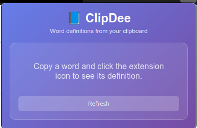

# 📘 ClipDee

> Instantly see the meaning of any word you copy.  
> A simple, privacy-friendly browser extension (Firefox + Chrome) that fetches word definitions straight from your clipboard.

---

## 🚀 Overview

**ClipDee** is a lightweight cross-browser extension that:

- Reads the last word you copied
- Instantly fetches its meaning via [Free Dictionary API](https://dictionaryapi.dev/)
- Displays results in a clean popup — no clutter, no extra steps

---

## 📥 Installation

### Firefox

1. Go to `about:debugging#/runtime/this-firefox`
2. Click **Load Temporary Add-on**
3. Select the `manifest.json` inside `clipdee-firefox/`

### Chrome

1. Navigate to `chrome://extensions/`
2. Enable **Developer Mode**
3. Click **Load unpacked**
4. Select the `clipdee-chrome/` folder

(*Store links will be added once published.*)

---

## 🎯 Usage

1. Copy any word  
2. Click the ClipDee icon in your toolbar  
3. Instantly see the definition popup ✨



(*screenshot/gif placeholder*)

---

## 📂 Repository Structure

```bash

.
├── clipdee-chrome/   # Chrome extension code
├── clipdee-firefox/  # Firefox extension code
└── README.md         # Root documentation

```

---

## 📜 License & Privacy

- [MIT License](clipdee-firefox/LICENSE)  
- [Privacy Policy](clipdee-firefox/PRIVACY_POLICY.md)

---

## 🤝 Contributing

Pull requests and suggestions are welcome! Please check each package’s README for details.
